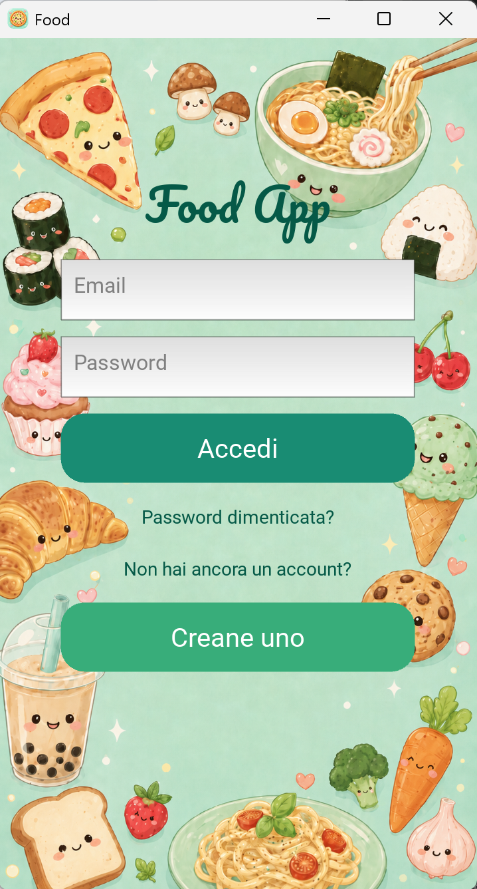
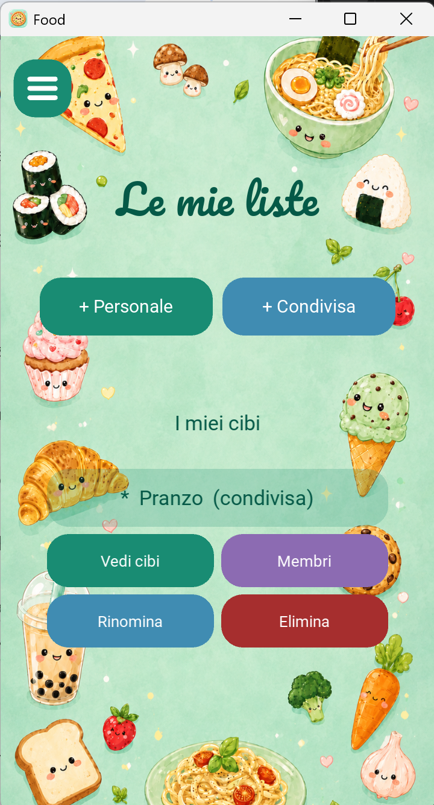
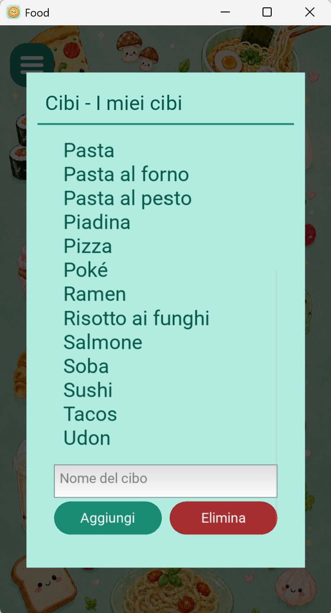

# Food App

[](https://github.com/laurabaraldi98-lgtm/food_kivy/actions/workflows/tests.yml)

A responsive food suggestion application built with Python and Kivy for desktop and Android.

Food App helps users decide what to eat by selecting a random item from one of their food lists. Users can create personal lists or share lists with other registered users. All data is stored remotely in Supabase and protected with PostgreSQL Row Level Security.

The interface is currently in Italian.

---

## Screenshots

| Login | Home |
| :---: | :---: |
|  |  |

| Personal and shared lists | Food management |
| :---: | :---: |
|  |  |

---

## Why I Built This

This project started from a very common problem: deciding what to eat.

The same question kept coming up:

> "What should we have for dinner?"

Usually followed by:

> "I don't know."

Instead of spending time trying to decide, I built a small application that makes the choice automatically.

The original idea was intentionally simple: keep a list of foods you actually eat, press a button, and let the app select one.

What began as a local Python project gradually evolved into a cross-platform application involving:

- a responsive graphical interface;
- remote data persistence;
- REST API communication;
- user authentication;
- personal and shared data;
- PostgreSQL Row Level Security;
- Android packaging;
- automated testing;
- continuous integration.

---

## Features

### Authentication

- User registration with email and password
- Email confirmation through Supabase
- User login and logout
- Password reset by email
- Authenticated API requests using access tokens

### Personal food lists

- Default list containing 22 foods for every new user
- Multiple personal lists
- Create, select, rename, and delete lists
- Separate foods for every list
- Automatic selection of an available list after login
- Clear indication of the currently active list

### Shared food lists

- Create a list shared with other registered users
- Add members by email address
- View the members of a shared list
- Remove members from a shared list
- Shared access to the same foods
- Owner and member roles
- Members can leave a shared list
- Only the owner can delete a shared list

### Food management

- View all foods in the active list
- Add foods
- Remove foods
- Case-insensitive duplicate detection
- Random food selection
- Immediate persistence in Supabase
- Shared changes visible to every authorized member

### Interface

- Responsive Kivy layouts
- Reusable rounded buttons
- Custom hamburger menu button
- Scrollable food-list screen
- Scrollable food-management popup
- One input field for adding and deleting foods
- Side-by-side add and delete buttons
- Density-independent dimensions with `dp`
- Scalable text sizes with `sp`
- Adaptive backgrounds
- Android software-keyboard handling
- Custom font, illustrations, and application icon
- Desktop and Android support

### Testing and automation

- 131 automated tests
- 100% statement coverage
- Tests for every Python application module
- GitHub Actions CI on pushes and pull requests
- Headless Kivy testing with Xvfb
- Automated Android build workflow
- Versioned PostgreSQL migrations

---

## How It Works

When the application starts, the login screen is displayed.

Users can:

- sign in with an existing account;
- open the registration screen;
- request a password-reset email.

New accounts can receive a confirmation email through Supabase. Authentication redirects are handled by responsive pages hosted with GitHub Pages:

```text
https://laurabaraldi98-lgtm.github.io/food_kivy/
```

After a successful login, Supabase returns a session containing an access token.

The application uses that token to load all the food lists available to the authenticated user. If at least one list exists, the first available list becomes active automatically.

The user can then:

1. open the list-management screen;
2. create or select a list;
3. add or remove foods;
4. return to the home screen;
5. press **Scegli per me**;
6. receive a randomly selected food from the active list.

Changes are sent immediately to Supabase, so lists and foods remain available after the application is closed.

Selecting logout invalidates the Supabase session, clears the application state, and returns the user to the login screen.

---

## Personal and Shared Lists

### Personal lists

A personal list belongs to one user through its `owner_id`.

Only its owner can:

- view it;
- rename it;
- delete it;
- view its foods;
- add foods;
- remove foods.

### Shared lists

A shared list is connected to an internal group through its `group_id`.

Groups do not have a separate screen in the application. Users interact directly with personal and shared lists from the same list-management screen.

When a shared list is created:

1. the application creates a group;
2. the creator becomes its owner;
3. the owner is added automatically as a group member;
4. the food list is connected to the group;
5. the owner can add registered users by email.

The permissions are:

| Action | Owner | Member |
| --- | :---: | :---: |
| View the shared list | Yes | Yes |
| View its foods | Yes | Yes |
| Add and remove foods | Yes | Yes |
| Rename the list | Yes | Yes |
| View members | Yes | Yes |
| Add members | Yes | No |
| Remove other members | Yes | No |
| Leave the list | No | Yes |
| Delete the list for everyone | Yes | No |

A regular member can leave without deleting the list for the remaining users.

Deleting a shared list removes its foods, memberships, and internal group through PostgreSQL cascade rules.

The owner cannot currently leave or transfer ownership. Ownership transfer may be implemented in a future version.

---

## Application Structure

Responsibilities are separated across multiple modules:

- `main.py` manages application state, the active list, and screen navigation;
- `auth_client.py` communicates with Supabase Authentication;
- `supabase_client.py` communicates with the Supabase REST API;
- `auth_screen.py` implements login and password reset;
- `signup_screen.py` implements registration;
- `food_lists_screen.py` manages personal and shared lists;
- `food_popup.py` manages foods inside the active list;
- `group_members_popup.py` manages shared-list members;
- `ui_components.py` contains reusable Kivy widgets.

The application deliberately uses standard HTTP requests instead of the full Supabase Python SDK.

This keeps the Android dependency tree smaller and avoids transitive packages that are difficult to cross-compile with python-for-android.

---

## Supabase REST Integration

The REST endpoints are built from the Supabase project URL.

For example:

```python
FOODS_URL = f"{SUPABASE_URL}/rest/v1/foods"
```

Protected requests include the authenticated user's access token:

```python
headers["Authorization"] = f"Bearer {access_token}"
```

The application uses:

- `GET` to retrieve lists, foods, groups, and members;
- `POST` to create records and call PostgreSQL functions;
- `PATCH` to rename lists and groups;
- `DELETE` to remove foods, lists, groups, and memberships;
- RPC endpoints for protected membership operations.

The access token identifies the current user. Database policies then determine which records that user is allowed to access.

---

## Database Model

The main PostgreSQL tables are:

- `default_foods` — template used to populate a new user's default list;
- `food_lists` — personal and shared lists;
- `foods` — food items connected to lists through `list_id`;
- `groups` — internal ownership records for shared lists;
- `group_members` — users allowed to access shared lists.

A personal list has an `owner_id`.

A shared list has a `group_id`.

A database constraint ensures that a list belongs either to one user or to one group, never both.

The `group_members` table stores the user's role:

- `owner`;
- `member`.

When a group is created, a PostgreSQL trigger automatically inserts its creator into `group_members` as the owner.

Database functions support authorization and membership management, including:

- checking whether a user belongs to a group;
- checking whether a user owns a group;
- checking access to a food list;
- retrieving group members;
- adding an existing user by email.

---

## Database Security

Row Level Security is enabled for application data.

The database policies enforce the following rules:

- anonymous users cannot access food data;
- users can access only their own personal lists;
- users can access shared lists only when they belong to the corresponding group;
- group members can view and modify foods in an accessible shared list;
- only the owner can add other members;
- only the owner can remove other members;
- members cannot add themselves to arbitrary groups;
- regular members can remove only their own membership when leaving;
- the owner's membership cannot be removed;
- only the owner can delete a shared list and its group.

These permissions are enforced in PostgreSQL, not only by hiding buttons in the interface.

The application uses the Supabase publishable key or legacy `anon` key together with the authenticated user's access token.

The `service_role` key must never be included in the client application.

The SQL schema, policies, functions, and triggers are stored as versioned migrations in:

```text
supabase/migrations/
```

---

## User Interface

The application uses a Kivy `ScreenManager` to navigate between:

- the login screen;
- the registration screen;
- the main food screen;
- the food-list management screen.

### Main screen

The main screen displays:

- the active food list;
- the **Scegli per me** button;
- the randomly selected result;
- the hamburger navigation button.

If no list is active, the user is asked to create one.

If the active list is empty, the user is asked to add foods first.

### Food-list screen

The list-management screen displays personal and shared lists together.

Shared lists are marked with:

```text
(condivisa)
```

Selecting a list reveals its available actions.

A shared-list owner sees the delete action, while a regular member sees the option to leave the list.

### Food-management popup

The food-management popup contains:

- a scrollable list of foods;
- one text field;
- an **Aggiungi** button;
- an **Elimina** button;
- status feedback.

The same input is used for both adding and deleting a food. The two action buttons are displayed side by side and use the reusable `RoundedButton` component.

### Member-management popup

The member popup displays every user who can access a shared list.

All members can view the participants. Only the owner sees the controls for adding or removing other members.

Duplicate memberships are rejected.

### Reusable components

`RoundedButton` draws its background with a Kivy `RoundedRectangle`.

`MenuButton` extends it and draws the hamburger icon using three canvas lines, so the icon does not depend on a special font character.

---

## Responsive Design

Desktop and Android devices can have very different:

- resolutions;
- pixel densities;
- physical dimensions;
- aspect ratios.

Raw pixel values caused controls to appear at inconsistent physical sizes.

The interface therefore uses:

- `dp` for widget dimensions, spacing, padding, and rounded corners;
- `sp` for text sizes;
- `size_hint` for proportional sizing;
- `pos_hint` for proportional positioning;
- scrollable layouts for content that may exceed the available space.

For example:

```python
self.choose_button.height = dp(48)
self.title_label.font_size = sp(34)
```

---

## Adaptive Backgrounds

Background images use:

```python
fit_mode="cover"
```

This fills the available screen without stretching the illustration.

However, the same image can be cropped differently on tall mobile displays.

The home screen therefore calculates the current aspect ratio:

```python
ratio = Window.width / Window.height
```

It then selects the appropriate asset:

```python
background_source = (
    "images/background_tall.png"
    if ratio < 0.48
    else "images/background.png"
)
```

Tall screens use `background_tall.png`, while standard displays use `background.png`.

---

## Mobile Keyboard Handling

On Android, the software keyboard can cover form controls.

The application uses:

```python
Window.softinput_mode = "below_target"
```

When the food input receives focus, the popup scrolls toward the field so that the input and buttons remain visible.

The focus handler runs only on Android:

```python
if platform != "android" or not focused:
    return
```

This prevents the popup from moving unnecessarily when the field is selected on desktop.

---

## Project Evolution

### 1. Local Python prototype

The original version stored foods in a local JSON file.

It focused on Python fundamentals, random selection, add and delete operations, and simple persistence.

### 2. Kivy graphical interface

The project was converted into a graphical application using Kivy widgets, layouts, labels, buttons, text inputs, popups, custom fonts, and image assets.

### 3. Supabase persistence

Local JSON storage was replaced by a PostgreSQL database hosted on Supabase.

This introduced remote persistence and REST API communication.

### 4. Android packaging

Buildozer and python-for-android were introduced to package the project for Android.

The Android application uses portrait orientation, Internet permission, a custom icon, and a reduced dependency set.

### 5. Dependency redesign

The first Supabase implementation used the full Python SDK.

Some transitive dependencies were problematic to cross-compile for Android, so the data and authentication layers were rewritten using direct `requests` calls.

### 6. Responsive redesign

Testing on physical Android devices revealed issues involving pixel density, aspect ratios, background cropping, popup positioning, and the software keyboard.

The interface was redesigned with `dp`, `sp`, adaptive images, proportional positioning, and scrollable content.

### 7. Authentication and security

Supabase Authentication, email confirmation, password reset, access tokens, protected requests, and PostgreSQL Row Level Security were added.

### 8. Multiple personal lists

The original single list evolved into multiple personal lists, including automatic creation of a default list for every new user.

### 9. Shared lists

Shared lists introduced groups, memberships, roles, protected PostgreSQL functions, database triggers, cascade deletion, and membership-based access control.

Groups remain an internal database implementation rather than a separate concept exposed in the interface.

### 10. Automated testing and CI

The test suite was expanded to cover HTTP clients, application state, Kivy screens, popups, reusable components, personal lists, shared lists, membership permissions, Android-specific behaviour, and error paths.

GitHub Actions now requires 100% statement coverage.

---

## Technologies

### Application

- Python 3
- Kivy
- Requests

### Backend and data

- Supabase
- Supabase Authentication
- PostgreSQL
- Supabase REST API
- Row Level Security
- PostgreSQL functions and triggers
- SQL migrations

### Testing

- pytest
- pytest-cov
- `unittest.mock`
- Xvfb
- GitHub Actions

### Android

- Buildozer
- python-for-android
- Android SDK
- Android NDK

### Web and development

- HTML
- CSS
- Git
- GitHub
- GitHub Pages

---

## Project Structure

```text
food_kivy/
├── .github/
│   └── workflows/
│       ├── build-apk.yml
│       └── tests.yml
├── docs/
│   ├── index.html
│   └── reset-password.html
├── fonts/
│   └── Pacifico-Regular.ttf
├── images/
│   ├── background.png
│   ├── background_tall.png
│   └── icon.png
├── screenshots/
│   ├── food-lists.png
│   ├── food-popup.png
│   ├── home.png
│   └── login.png
├── supabase/
│   ├── migrations/
│   │   ├── 20260908_initial_foods_schema.sql
│   │   ├── 20260909_enable_foods_rls.sql
│   │   ├── 20260912091103_create_food_lists.sql
│   │   ├── 20260912210221_allow_deleting_default_food_lists.sql
│   │   ├── 20260913132317_create_groups.sql
│   │   ├── 20260913133034_manage_group_members.sql
│   │   ├── 20260913134347_connect_groups_to_food_lists.sql
│   │   └── 20260913191848_restrict_group_member_management.sql
│   ├── .gitignore
│   └── config.toml
├── tests/
│   ├── test_auth_client.py
│   ├── test_auth_screen.py
│   ├── test_food_lists_screen.py
│   ├── test_food_popup.py
│   ├── test_group_members_popup.py
│   ├── test_main.py
│   ├── test_signup_screen.py
│   ├── test_supabase_client.py
│   └── test_ui_components.py
├── .gitignore
├── auth_client.py
├── auth_screen.py
├── buildozer.spec
├── food_lists_screen.py
├── food_popup.py
├── group_members_popup.py
├── main.py
├── pytest.ini
├── signup_screen.py
├── supabase_client.py
├── ui_components.py
└── README.md
```

A local `config.py` file is also required, but it is excluded from Git because it contains the Supabase project configuration.

---

## Configuration

Create `config.py` in the project root:

```python
SUPABASE_URL = "your-supabase-project-url"
SUPABASE_KEY = "your-supabase-publishable-or-anon-key"
```

Use the Supabase publishable key or legacy `anon` key.

Never place the `service_role` key inside the application.

`config.py` is included in `.gitignore` and must not be committed with real project values.

---

## Run Locally

Clone the repository:

```bash
git clone https://github.com/laurabaraldi98-lgtm/food_kivy.git
cd food_kivy
```

Optionally create a virtual environment:

```bash
python -m venv .venv
```

Activate it on Windows:

```powershell
.venv\Scripts\Activate.ps1
```

Install the dependencies:

```bash
python -m pip install kivy requests pytest pytest-cov
```

Create `config.py` with the required Supabase values.

Run the application:

```bash
python main.py
```

---

## Tests

Run the complete test suite:

```bash
python -m pytest
```

Run the tests with the same coverage requirement used by GitHub Actions:

```bash
python -m pytest --cov=auth_client --cov=auth_screen --cov=food_lists_screen --cov=food_popup --cov=group_members_popup --cov=main --cov=signup_screen --cov=supabase_client --cov=ui_components --cov-report=term-missing --cov-fail-under=100
```

The current suite contains **131 tests** and maintains **100% statement coverage** across all Python application modules.

Tests run automatically on every push and pull request.

Xvfb provides a virtual display for Kivy tests on the GitHub Actions Ubuntu runner.

---

## Android Build

Android packaging is configured in `buildozer.spec`.

The application requirements are:

```ini
requirements = python3,kivy,requests,certifi,urllib3,idna,charset_normalizer
```

The Android configuration includes:

```ini
orientation = portrait
android.permissions = INTERNET
android.api = 35
android.minapi = 24
android.ndk_api = 24
```

The application icon is configured with:

```ini
icon.filename = images/icon.png
```

The repository contains a GitHub Actions workflow for automated Android builds.

Earlier versions were packaged and tested on physical Android devices. The current shared-list version still requires a new APK build and physical-device test.

---

## Current Limitations

- The session exists only while the application is running.
- Users must sign in again after restarting the application.
- Automatic access-token refresh is not implemented.
- Users must already have an account before they can be added to a shared list.
- There is no invitation flow for users without an account.
- Group ownership cannot currently be transferred.
- Database requests are synchronous.
- The application requires an Internet connection.
- Network errors have limited user-facing feedback.
- Offline caching and retry handling are not implemented.
- The interface is available only in Italian.
- The current shared-list version still needs physical Android testing.

---

## Possible Future Improvements

- Persistent login
- Automatic token refresh
- Secure local session storage
- Shared-list invitations
- Group ownership transfer
- Improved loading indicators
- Better network-error feedback
- Asynchronous requests
- Retry handling
- Offline caching
- Synchronization after reconnecting
- Food categories
- Filters and favourites
- Additional languages
- Further animations and UI improvements

---

## What I Learned

This project provided practical experience with:

### Python and application structure

- separating responsibilities between modules;
- object-oriented programming and inheritance;
- application state management;
- reusable functions and UI components;
- external configuration;
- validation and exception handling;
- synchronization between local and remote state.

### Kivy and Android

- widgets and layouts;
- screen navigation;
- popups and dropdown menus;
- canvas drawing;
- custom fonts and images;
- responsive design using `dp` and `sp`;
- scrollable mobile layouts;
- software-keyboard and focus handling;
- Buildozer and python-for-android;
- Android dependency compatibility;
- APK creation and physical-device testing.

### APIs, databases, and security

- REST API communication;
- HTTP methods, headers, and JSON payloads;
- Supabase Authentication;
- access tokens;
- PostgreSQL relational modelling;
- foreign keys and cascade deletion;
- Row Level Security;
- membership-based authorization;
- PostgreSQL functions, triggers, constraints, and migrations.

### Testing and Git

- pytest and pytest-cov;
- mocking HTTP requests;
- patching application dependencies;
- testing Kivy widgets and nested callbacks;
- testing platform-specific behaviour;
- maintaining 100% statement coverage;
- Git branches, commits, pull requests, and merges;
- GitHub Actions and automated builds.

---

## Status

The current version includes:

- registration, email confirmation, login, logout, and password reset;
- authenticated Supabase requests;
- multiple personal lists;
- default list creation with 22 foods;
- shared multi-user lists;
- owner and member permissions;
- member management by email;
- PostgreSQL Row Level Security;
- persistent remote data;
- random food selection;
- responsive desktop and Android layouts;
- custom application branding;
- 131 automated tests;
- 100% statement coverage.

The authentication flow, personal lists, shared lists, member management, and food operations are working on desktop.

The next planned development phase is persistent session storage with automatic token refresh, followed by a new Android build and physical-device test.