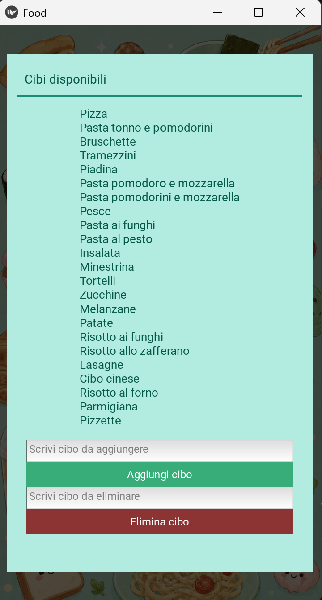

# Food App

A simple food suggestion application built with Python and Kivy.

The app helps users decide what to eat by randomly selecting a food from a customizable list. Users can add new foods, remove existing foods, and keep their list saved between sessions using Supabase as remote storage.

The application interface is currently in Italian.

## Why I Built This

This project started from a very common problem: deciding what to eat. Every day, the same question came up — "What should we have for dinner?" — followed by the same uncertain "I don't know, whatever."

Instead of letting indecision drag on, I built a small app that picks a suggestion for you. You keep a list of foods you actually eat, and when you can't decide, the app decides for you. Simple, but it solves a real everyday annoyance.

## Features

* Random food suggestion
* Add new foods to the list
* Remove foods from the list
* Save the food list using Supabase
* Preserve added and removed foods between sessions
* Simple graphical interface
* Italian-language interface
* Desktop support
* Android version in development

## How It Works

The application connects to a Supabase database and loads the available food options from a `foods` table.

Users can:

1. Add a new food to the list.
2. Remove a food they no longer want.
3. Ask the app to randomly select one of the available foods.

When a food is added or removed, the change is saved to Supabase. This means that changes remain available after the application is closed and reopened.

At this stage, the app uses one shared food list. Future versions may include user accounts and private or shared food lists.

## Project Evolution

The first version of the app stored the food list locally in a JSON file.

The project was later refactored to use Supabase as remote storage. This allowed me to practice working with an external database, loading data from a remote source, inserting new records, and deleting existing records.

This refactor also helped me practice separating local configuration from public source code by keeping the Supabase credentials in a local `config.py` file ignored by Git.

## Screenshots

### Main screen


### Food list management



## Technologies Used

* Python
* Kivy
* Supabase
* Buildozer
* Git
* GitHub

## Installation

### Run the App on Desktop

Make sure Python is installed on your computer.

Clone the repository:

```bash
git clone YOUR_REPOSITORY_LINK
